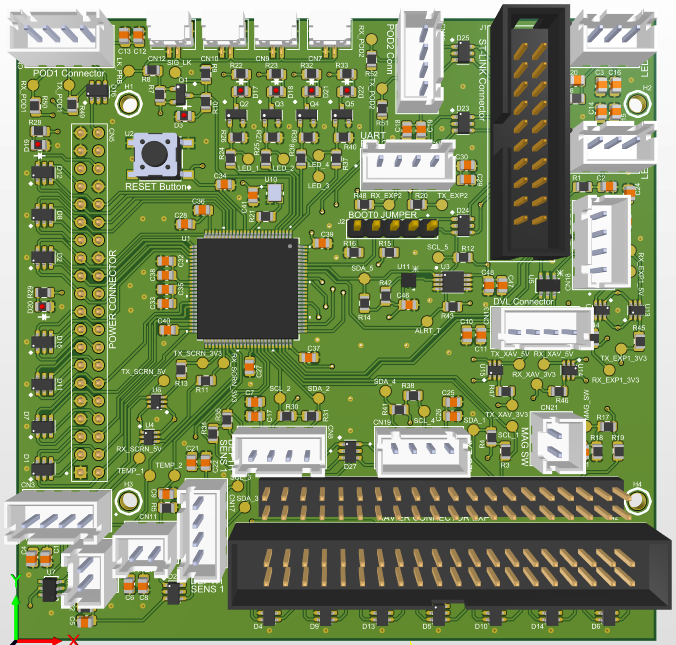
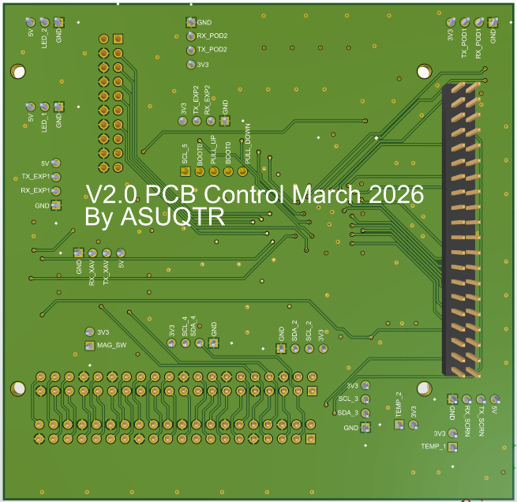
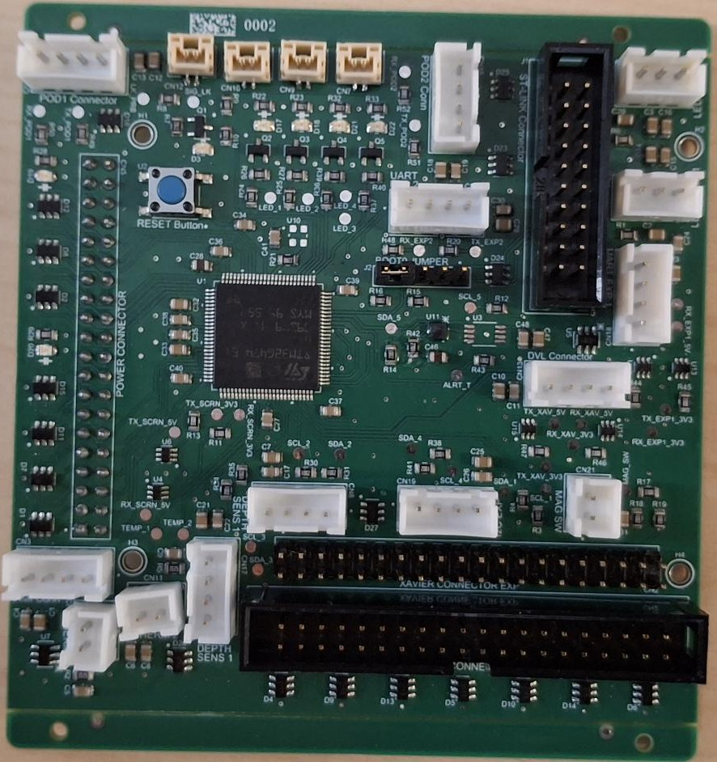
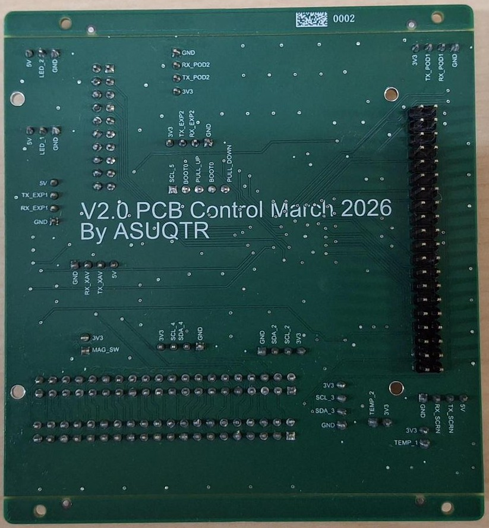

### **Ce projet a été réalisé par Louis Lavallée pour le club étudiant ASUQTR.**

Ce projet fut réalisé dans le cadre du projet de fin d'étude en équipe du baccalauréat en génie électrique à l'UQTR. Le projet d'équipe était centralisé sur la poursuite du développement du sous-marin autonome du club étudiant ASUQTR. 
Deux PCB principaux sont présents dans le sous-marin: le PCB de puissance qui distribue la puissance des batteries aux différents systèmes et le PCB de contrôle qui agit comme intermédiaire entre le Jetson Xavier AGX et les capteurs et actionneurs. Les deux PCB étant devenus obsolètes, il était nécessaire d'en concevoir de nouvelles versions.

Le PCB présenté ici est sensé remplacer l'ancien PCB de contrôle. Ce dernier comporte des éléments non-essentiels ou défectueux. La nouvelle version élimine les éléments superflus, ajoute un microcontrôleur STM32G474VET6 et étend la connectivité du PCB. L'ajout du microcontrôleur permet de générer des PWM et mesurer des tensions par des ADC à l'aide d'un seul composant programmable plutôt que plusieurs composants séparés. Le microcontrôleur offre aussi une plus grande quantité de ports I2C et UART que le Jetson Xavier AGX. Donner une capacité de prise de décision au PCB permet de lui déléguer des tâches et lui confier des protocoles de sécurité en cas de détection de défaillance du sous-marin.\
L'ancien PCB de contrôle a été réalisé par Bastien Côté, un ancien membre du club étudiant ASUQTR. Certain circuits présents sur l'ancien PCB ont été réutilisés pour la conception de la nouvelle version.

La réalisation du projet est décrite en détail dans cet extrait du rapport de PFE d'équipe: [Extrait du rapport de projet]()

Le logiciel utilisé pour ce projet est Altium Designer Professionnal (24.1.2).\
Le PCB a été imprimé et partiellement assemblé chez JLCPCB. Le reste de l'assemblage a été fait à la main.

## Visuel 3D du nouveau PCB de contrôle
 

## Nouveau PCB de contrôle une fois imprimé et assemblé
 
